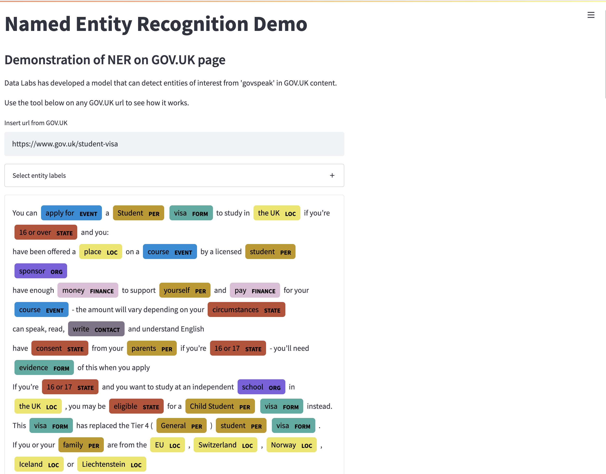

# streamlit-entities

A repository to build a streamlit app that can visualise entities nicely extracted using a NER model.



## How to use this app

1. Clone this repository

2. Create a new environment, and install the `requirements.txt` file

```python
pip install -r requirements.txt
```

3. Download your model to the '/Models' folder.

Models are currently not pushed to or held in this repository due to their size. You must download these models to the `Models/` folder manually.

For example, if your NER model is pytorch/HuggingFace, copy the entire folder that contains your `config.json`, `pytorch_model.bin`. This can be any checkpointed file.

4. Define location of your model and tokeniser

In `config.py`, set your relative locations of both your model and your tokenizer 

`MODEL_PATH= "./Models/{model_name/chekpoint(optional)}"`

`TOKENIZER_PATH= "./Models/{model_name/chekpoint(optional)}"` 

5. Run the web-app from the command line

Run:
```python
streamlit run streamlit-app.py 
```

The web app should launch in a browser. If not, copy the address to your local host into your browser.

Note:
The app may take 10+ seconds when it first launches, this is because the model is being loaded for the first time. After the model is loaded, it is cached, so each execution thereafter will be much quicker (1-2 seconds)

